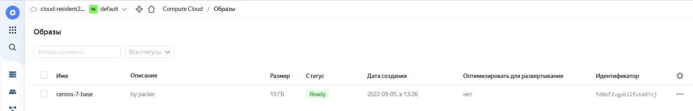
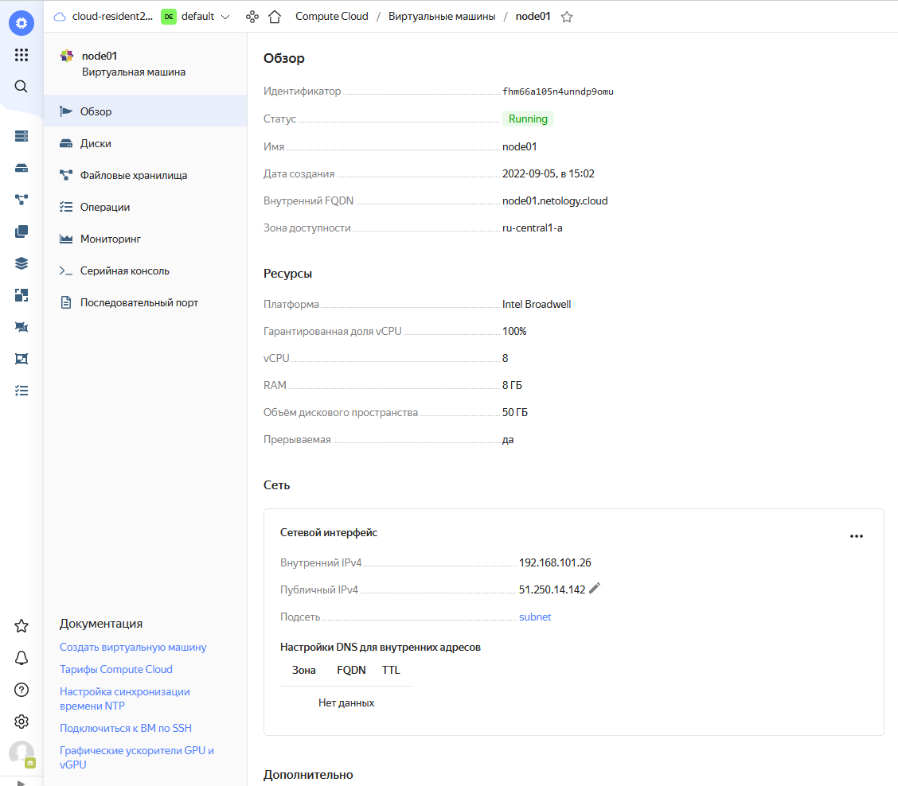
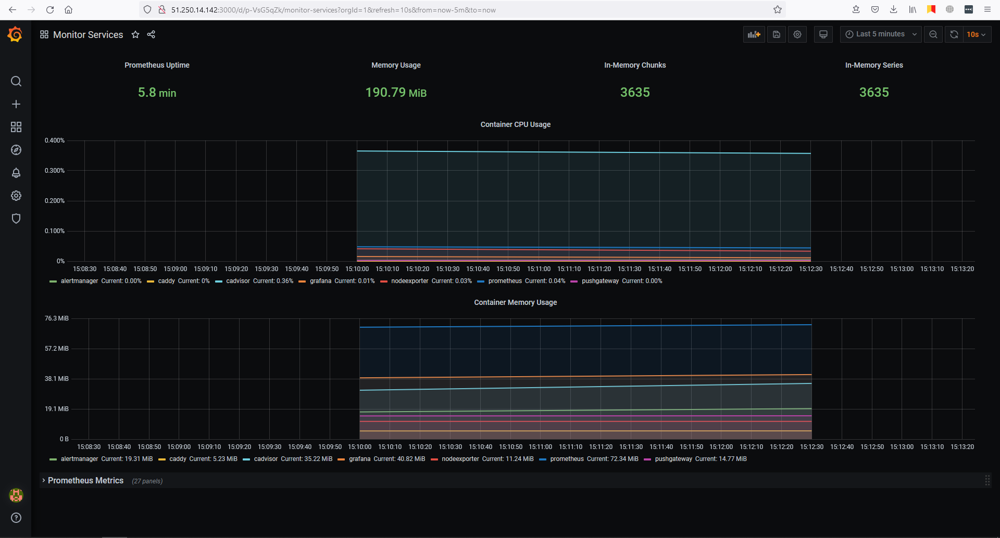
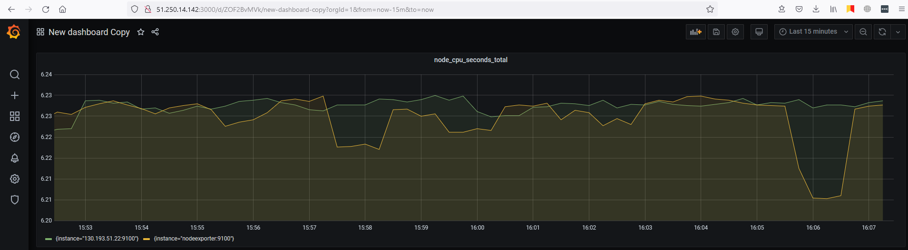
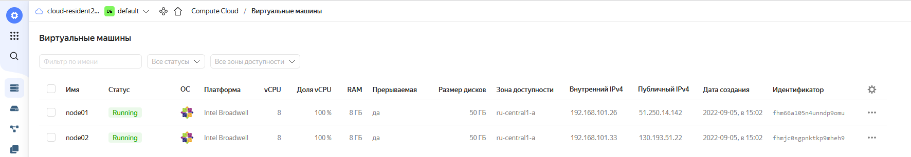

# Домашнее задание к занятию "5.4. Оркестрация группой Docker контейнеров на примере Docker Compose"
1. Созданный через Packer образ:  
   
2. Созданная виртуальная машина:  
   
3. Web-интерфейс Grafana:  
   
4. На скорую руку сделанный дашборд с параметром node_cpu_seconds_total для двух разных машин:  
     
   Список созданных виртуальных машин для подтверждения что это данные c реальной второй машины:  
   